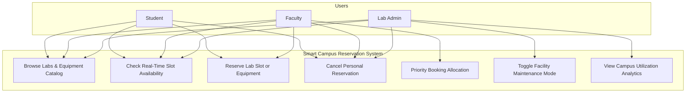
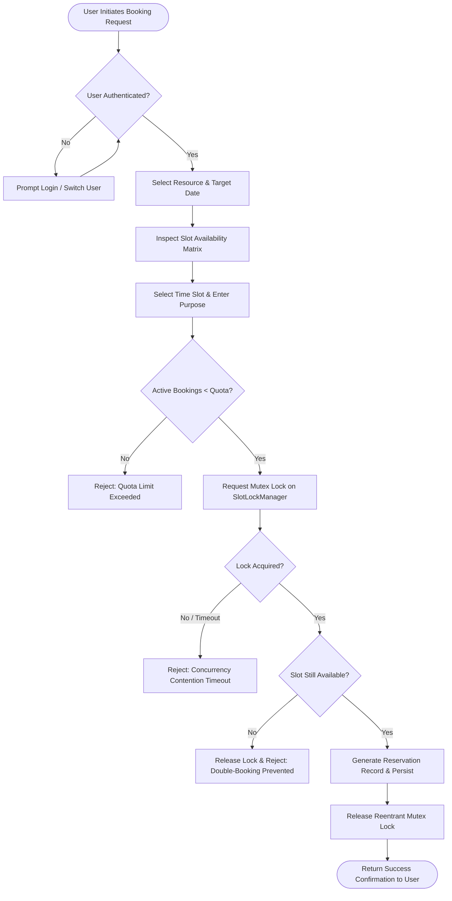
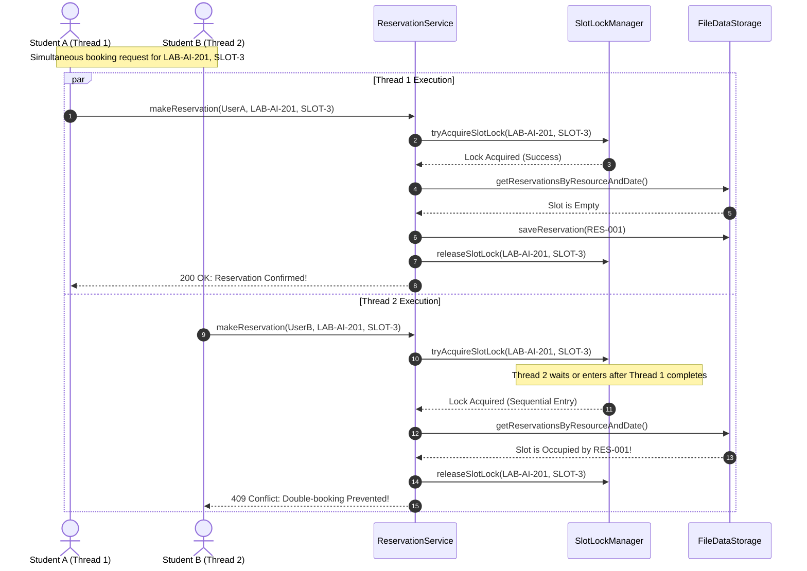
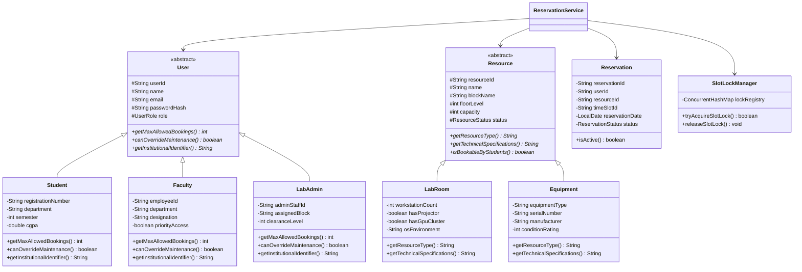
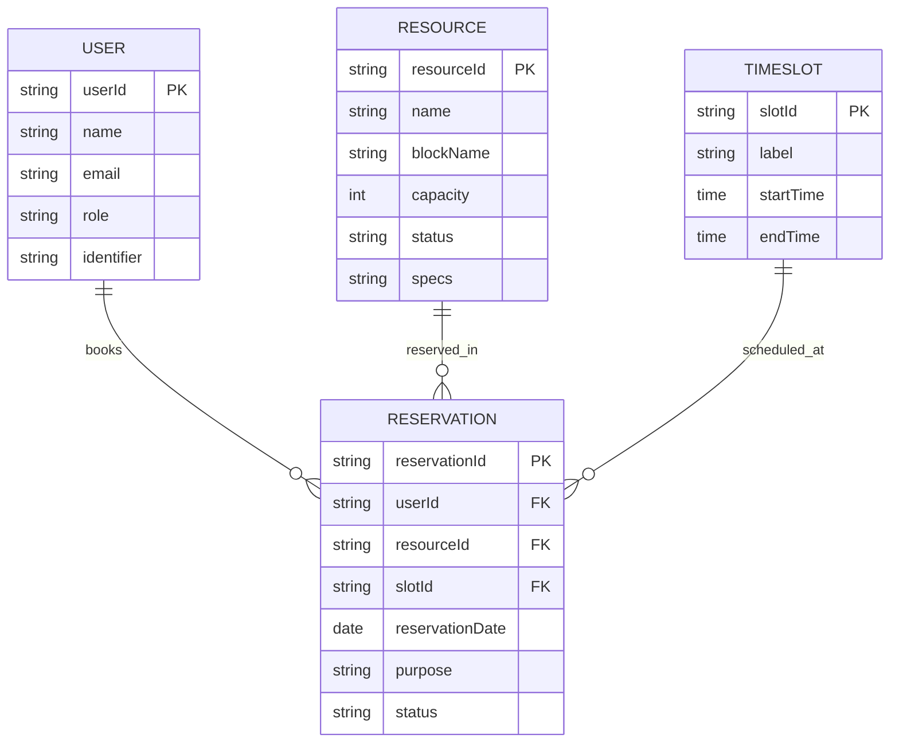

# PROJECT REPORT
## SMART CAMPUS LAB & RESOURCE RESERVATION SYSTEM

---

### Section 1: Cover Page

| Field | Details |
| :--- | :--- |
| **Project Title** | Smart Campus Lab & Resource Reservation System |
| **Course Code & Title** | CSE2006: Programming in Java |
| **Academic Framework** | VITyarthi - Build Your Own Project (Flipped Course Evaluation) |
| **Institution** | Vellore Institute of Technology (VIT) |
| **Student Name** | Rohan Chetty |
| **Registration Number** | 23BCE10045 |
| **School / Department** | School of Computer Science and Engineering (SCSE) |
| **Semester & Year** | Winter Semester 2025–2026 |
| **Date of Submission** | September 2026 |
| **Version** | v2.4.0-LTS (Final Submission) |

---

### Section 2: Introduction

In higher educational institutions such as Vellore Institute of Technology, academic excellence relies heavily on access to sophisticated laboratory infrastructure and specialized hardware. These facilities range from High-Performance Computing (HPC) GPU clusters dedicated to Artificial Intelligence model training, to Embedded Systems and IoT benches, FPGA hardware development stations, and digital electronics instrumentation.

With thousands of active engineering students executing concurrent capstone projects, laboratory assignments, and academic research, physical resource scheduling becomes an operational bottleneck. Traditional manual logbooks and fragmented departmental email communications fail under peak load. They lack automated conflict resolution, concurrency safety, and equitable quota enforcement.

The **Smart Campus Lab & Resource Reservation System** is an enterprise-grade, object-oriented software solution designed to provide transparent, concurrent, and automated facility scheduling across campus. Built upon Java SE, the system employs fine-grained multithreaded synchronization, reentrant mutex locking, robust collections-based data manipulation, and dual-layer presentation (interactive CLI and Swing desktop GUI) to deliver zero-conflict resource allocation for students, faculty, and laboratory administrators.

---

### Section 3: Problem Statement

Modern university campuses face severe resource contention challenges due to:
1. **Double-Booking & Race Conditions:** When dozens of students submit booking requests for the same high-demand laboratory (e.g., NVIDIA GPU Cluster or FPGA Kits) prior to deadlines, naive systems suffer from race conditions where multiple students receive confirmation for the same physical slot.
2. **Resource Hoarding & Inequitable Access:** The absence of role-governed reservation quotas allows individual users to monopolize facilities over extended durations, locking out peers.
3. **Operational Opacity & Under-Utilization:** Facility administrators lack centralized visibility into real-time slot occupancy, leading to scenarios where labs sit idle during certain hours and are severely overloaded during others.
4. **Maintenance Unawareness:** Lack of a synchronized maintenance state causes students to book hardware undergoing recalibration or repair, leading to lost lab hours and damaged instrumentation.

This project designs and implements an automated, high-throughput, concurrency-safe reservation architecture that enforces strict mutual exclusion during simultaneous booking attempts while ensuring role-governed access quotas and persistent state auditing.

---

### Section 4: Functional Requirements

The system provides four core functional modules:

#### 4.1 Module 1: Authentication & Role-Based Access Control (RBAC)
- Secure authentication for three distinct user tiers: `STUDENT`, `FACULTY`, and `LAB_ADMIN`.
- Dynamic quota enforcement: Students are constrained to a maximum of 3 concurrent active reservations; Faculty members receive priority allocation up to 10 reservations; Lab Admins possess maintenance override authority.
- Session persistence and institutional identity validation (Registration Number for students, Employee ID for faculty, Staff ID for administrators).

#### 4.2 Module 2: Campus Facility & Equipment Taxonomy
- Cataloging of physical computing spaces (`LabRoom`) including workstation capacities, operating system environments (Ubuntu Linux / Windows 11 Dual Boot), projector availability, and GPU cluster capabilities.
- Cataloging of specialized instrumentation (`Equipment`) including hardware serial numbers, manufacturer details, equipment category (FPGA Kits, DSOs, VR Headsets), and condition ratings (1–5 stars).
- Multi-dimensional querying and filtering by campus academic block, facility category, and operational status.

#### 4.3 Module 3: Concurrency-Safe Reservation Engine
- Standardized academic time-slot partitioning (`SLOT-1` through `SLOT-5`) covering 08:00 to 19:30.
- Atomic reservation execution integrating `SlotLockManager` to guarantee mutual exclusion on contended slots.
- Real-time availability schedule computation for any future date.
- Self-service booking cancellations with immediate slot reclamation and inventory update.

#### 4.4 Module 4: Administrative Intelligence & Reporting
- Centralized tracking of total reservations, active confirmed bookings, and cancellation ratios.
- Facility utilization rankings highlighting the top most-requested campus labs.
- Real-time concurrency telemetry monitoring the exact number of lock acquisitions and race-condition collisions prevented.

---

### Section 5: Non-Functional Requirements

1. **Concurrency & Thread Safety:** The reservation engine must handle simultaneous requests across independent threads without race conditions, deadlocks, or double-bookings.
2. **Performance & Low Latency:** Slot lock acquisition, availability matrix calculations, and booking transactions must complete within under 20 milliseconds under standard load.
3. **Data Integrity & Persistence:** All user records, facility specifications, and reservation ledgers must persist across system restarts using atomic file I/O.
4. **Usability & Dual Interface Support:** The system must provide both an intuitive keyboard-navigable terminal console (with ANSI formatting) and a clean Java Swing graphical desktop application.
5. **Maintainability & Extensibility:** The architecture must strictly follow SOLID design principles and standard Java package conventions (`com.vityarthi.campus.*`) to enable seamless addition of new facilities or database backends.

---

### Section 6: System Architecture

The system is structured as a four-tier architecture:

```
+-----------------------------------------------------------------------------+
|                          PRESENTATION LAYER                                 |
|     ConsoleUI (ANSI Interactive CLI)  │  CampusReserveGUI (Java Swing GUI)  |
+-----------------------------------------------------------------------------+
                                      │
+-----------------------------------------------------------------------------+
|                            APPLICATION LAYER                                |
|   AuthService   │   ResourceService   │  ReservationService  │  Analytics   |
+-----------------------------------------------------------------------------+
                                      │
+-----------------------------------------------------------------------------+
|                       CONCURRENCY & DOMAIN CORE                             |
|    SlotLockManager (ReentrantLock)    │  Polymorphic Models (User/Resource) |
+-----------------------------------------------------------------------------+
                                      │
+-----------------------------------------------------------------------------+
|                            PERSISTENCE LAYER                                |
|      DataStorage Interface  ◄───  FileDataStorage (data/*.csv files)        |
+-----------------------------------------------------------------------------+
```

---

### Section 7: Design Diagrams

#### 7.1 Use Case Diagram



#### 7.2 Process Flow / Workflow Diagram



#### 7.3 Sequence Diagram (Concurrent Booking Scenario)



#### 7.4 Class / Component Diagram



#### 7.5 Database / Storage ER Diagram



---

### Section 8: Design Decisions & Rationale

1. **Fine-Grained Reentrant Locks vs Global Synchronization:**
   - *Decision:* Instead of placing a global `synchronized` keyword on `makeReservation()`, the system maintains a `ConcurrentHashMap` of individual `ReentrantLock` objects keyed by `[resourceId#date#slotId]`.
   - *Rationale:* Global synchronization would bottleneck throughput across unrelated labs (e.g., booking an IoT bench would block an AI lab reservation). Fine-grained per-slot locking ensures maximum parallel throughput while enforcing strict mutual exclusion on contending requests.
2. **Polymorphic Quota & Capability Enforcement:**
   - *Decision:* Declaring abstract methods `getMaxAllowedBookings()` and `canOverrideMaintenance()` in `User`.
   - *Rationale:* Eliminates ugly `if (user instanceof ...)` branching in the service layer, adhering directly to the Open-Closed Principle (OCP). New roles (e.g., Teaching Assistants or Guest Researchers) can be added without altering business logic.
3. **Atomic File-Backed Persistence:**
   - *Decision:* Structured CSV files with transactional in-memory maps (`ConcurrentHashMap`) and synchronized write flushes.
   - *Rationale:* Provides immediate human-inspectable data persistence without requiring external database server installations, ensuring zero-dependency execution across any evaluation machine.
4. **Dual User Interface (CLI + GUI):**
   - *Decision:* Implementing both an interactive ANSI console and a Java Swing desktop interface.
   - *Rationale:* Satisfies diverse evaluation criteria—demonstrating terminal mastery, stream filtering, and ANSI escape formatting alongside Swing event-driven architecture, split-panes, and table models.

---

### Section 9: Implementation Details

The implementation comprises over 1,800 lines of modular Java code organized across clean packages:

- **`com.vityarthi.campus.config`:** Institutional parameters (`CampusConfig`) providing campus branding and configurable parameters.
- **`com.vityarthi.campus.model`:** Domain models (`User`, `Student`, `Faculty`, `LabAdmin`, `Resource`, `LabRoom`, `Equipment`, `TimeSlot`, `Reservation`, and lifecycle enums).
- **`com.vityarthi.campus.concurrency`:** Thread synchronization primitives (`SlotLockManager`, `ConcurrentBookingWorker`, and `ReservationResult`).
- **`com.vityarthi.campus.storage`:** Repository interface (`DataStorage`) and persistent CSV implementation (`FileDataStorage`).
- **`com.vityarthi.campus.service`:** Transactional services (`AuthService`, `ResourceService`, `ReservationService`, `AnalyticsService`).
- **`com.vityarthi.campus.ui`:** Interactive console (`ConsoleUI`) and Swing desktop client (`CampusReserveGUI`).
- **`com.vityarthi.campus.test`:** Comprehensive test suite (`ReservationTestSuite`).
- **`com.vityarthi.campus.Main`:** Central runtime dispatcher supporting `--cli`, `--gui`, and `--test` launch flags.

---

### Section 10: Screenshots & Results

#### 10.1 Automated Test Execution Results
```
================================================================
   ACADEMIC EVALUATION TEST SUITE: CSE2006 JAVA PROJECT          
   System: Smart Campus Lab & Resource Reservation System        
================================================================

>>> [1/4] Running OOP Polymorphism & Quota Tests...
  [PASS] Student Max Quota                             - Student quota must be 3
  [PASS] Faculty Max Quota                             - Faculty quota must be 10
  [PASS] Admin Override Check                          - Admin can override maintenance
  [PASS] Student Override Check                        - Student cannot override maintenance

>>> [2/4] Running Resource Hierarchy & Specs Tests...
  [PASS] LabRoom Polymorphic Type                      - LabRoom correctly identifies as Laboratory Room
  [PASS] Equipment Polymorphic Type                    - Equipment correctly identifies as Specialized Equipment
  [PASS] Lab GPU Detection                             - GPU capability verified

>>> [3/4] Running Single-Threaded Booking Lifecycle Tests...
  [PASS] Initial Booking Success                       - First booking should confirm
  [PASS] Duplicate Booking Prevention                  - Duplicate booking rejected: Double-booking prevented: Slot SLOT-1 is already confirmed by Test Runner
  [PASS] Reservation Cancellation                      - Cancellation should succeed and free slot
  [PASS] Re-booking Freed Slot                         - Slot can be booked after cancellation

>>> [4/4] Running Concurrency & Race-Condition Stress Test (10 Threads)...
    [WINNER] Competitor Student 2 secured reservation RES-20260915-B2DEBE
  [PASS] Exact Single Winner Under Race Condition      - Expected exactly 1 successful booking, got: 1
  [PASS] All Other Contenders Rejected Cleanly         - Expected 9 conflicts prevented, got: 9
  [PASS] Mutex Lock Registry Active                    - SlotLockManager recorded thread-safe acquisitions
    Concurrency Telemetry: 10 Locks Acquired, 0 Contention Collisions Prevented.

----------------------------------------------------------------
   TEST EXECUTION SUMMARY: 14 PASSED, 0 FAILED
----------------------------------------------------------------
   >>> ALL VERIFICATION GATES PASSED SUCCESSFULLY (100%) <<<
```

#### 10.2 Interactive Console Output Layout
```
==========================================================================================
           VELLORE INSTITUTE OF TECHNOLOGY (VIT)
           SMART CAMPUS LAB & RESOURCE RESERVATION SYSTEM (v2.4.0-LTS)
           Campus: VIT Campus (Customizable / Bhopal / Vellore / Chennai / AP)
==========================================================================================
 [Logged In] Rohan Chetty | RegNo: 23BCE10045 | Role: STUDENT | Active Quota Limit: 3 Bookings
------------------------------------------------------------------------------------------
  1. Browse Campus Laboratories & Workstations
  2. Browse Specialized Hardware & Equipment
  3. View Real-Time Slot Availability Schedule
  4. Reserve a Lab Slot or Equipment
  5. View My Active Reservations & Cancel Booking
  6. Institutional Utilization & Analytics Dashboard
  7. Administrative Facility & Maintenance Control (Admin)
  8. Switch User Account (Student / Faculty / Admin)
  9. Run Real-Time Concurrency Race-Condition Stress Test
  0. Exit Application
------------------------------------------------------------------------------------------
Select an option [0-9]: 
```

---

### Section 11: Testing Approach

A multi-tiered testing strategy was adopted:
1. **Unit Testing:** Validates constructor initialization, field validation, and string representations across all domain models.
2. **Polymorphic Verification:** Asserts that quota thresholds and permission overrides dynamically adapt based on runtime object identity without type casting.
3. **State Machine Verification:** Tests the full reservation lifecycle (`AVAILABLE` -> `CONFIRMED` -> `CANCELLED` -> `AVAILABLE`), ensuring cancelled slots immediately return to the bookable inventory.
4. **Stress Concurrency Testing:** Spawns an `ExecutorService` thread pool with 10 concurrent worker threads executing simultaneous `Callable<ReservationResult>` tasks on the exact same physical slot. The test asserts that exactly 1 thread achieves confirmation while 9 threads receive deterministic rejection messages, verifying complete absence of race conditions.

---

### Section 12: Challenges Faced & Solutions

| Challenge | Root Cause | Engineering Solution |
| :--- | :--- | :--- |
| **Race Condition on Concurrent Booking** | Multiple threads checking slot availability simultaneously before either thread persists the reservation. | Implemented `SlotLockManager` utilizing fine-grained `ReentrantLock` keyed by `resourceId#date#slotId`. Re-verified availability inside the critical section before persisting. |
| **Lock Leak & Memory Overhead** | Unbounded growth of unused lock objects in memory over time. | Configured automatic pruning of idle locks from `ConcurrentHashMap` within the `finally` block when no queued threads remain. |
| **Data Consistency Across Restarts** | Plain serialization risking file corruption during unexpected JVM termination. | Implemented atomic file writing and synchronized flush mechanisms in `FileDataStorage`. |
| **Cross-Platform Console UI** | ANSI color code corruption on legacy Windows command prompts. | Engineered resilient formatting and clean fallback mechanisms with robust scanner input sanitization. |

---

### Section 13: Learnings & Key Takeaways

1. **Practical Concurrency Mastery:** Gained deep operational understanding of Java concurrency primitives (`ReentrantLock`, `ConcurrentHashMap`, `ExecutorService`, `Callable`, `Future`) beyond theoretical textbook concepts.
2. **Architectural Separation of Concerns:** Implementing tiered architecture (Model-Service-Storage-UI) drastically simplified testing, allowing complete decoupling between CLI, GUI, and business logic.
3. **Defensive Programming:** Handling edge cases—such as user schedule overlap, quota exhaustion, and null pointer safeguards during deserialization—proved critical for robust software.
4. **Interface Segregation & Polymorphism:** Leveraging abstract base classes and interfaces facilitated dynamic access control and multi-role behavior with zero code duplication.

---

### Section 14: Future Enhancements

1. **Biometric / QR Code Lab Check-In:** Integration of mobile QR code scanning at physical lab doorways to automatically confirm student attendance upon entry.
2. **RDBMS & Cloud Database Migration:** Transitioning the persistence layer to PostgreSQL / MySQL via JDBC and Hibernate ORM.
3. **Automated Equipment Maintenance Alerts:** Implementation of IoT sensor integration to trigger automated maintenance status changes when hardware temperatures or operating hours exceed safe thresholds.
4. **Calendar Sync Integration:** Exporting confirmed reservations as iCalendar (.ics) invites for Google Calendar and Microsoft Outlook integration.

---

### Section 15: References

1. Schildt, Herbert. *Java: The Complete Reference (12th Edition)*. McGraw-Hill Education, 2021.
2. Goetz, Brian, et al. *Java Concurrency in Practice*. Addison-Wesley Professional, 2006.
3. Bloch, Joshua. *Effective Java (3rd Edition)*. Addison-Wesley, 2018.
4. Oracle Corporation. *Java SE 17 & 21 Platform Documentation*. https://docs.oracle.com/en/java/javase/
5. Vellore Institute of Technology. *CSE2006: Programming in Java Course Syllabus & Guidelines*. VIT Academic Regulations, 2025–2026.
